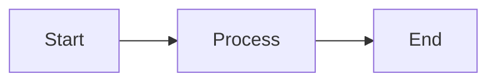

# Documentation

This project uses MkDocs with the Material theme for documentation.

## View Documentation Locally

```bash
# Install dependencies
source venv/bin/activate
pip install mkdocs mkdocs-material 'mkdocstrings[python]' mkdocs-mermaid2-plugin

# Serve documentation locally
cd docs
mkdocs serve

# Open browser to http://localhost:8000
```

## Build Documentation

```bash
cd docs
mkdocs build

# Output will be in docs/site/
```

## Documentation Structure

```
docs/
├── mkdocs.yml              # MkDocs configuration
├── docs/                   # Markdown documentation files
│   ├── index.md           # Home page
│   ├── getting-started/   # Getting started guides
│   ├── deployment/        # Deployment guides
│   ├── security/          # Security documentation
│   ├── operations/        # Operations guides
│   ├── api/               # API reference
│   └── stylesheets/       # Custom CSS
└── site/                  # Generated static site (git-ignored)
```

## Writing Documentation

### Add New Page

1. Create markdown file in `docs/docs/` directory
2. Add to navigation in `mkdocs.yml`:

```yaml
nav:
  - New Section:
    - Page Title: path/to/page.md
```

3. Build and preview:

```bash
mkdocs serve
```

### Using Mermaid Diagrams

```markdown

```

### Using Admonitions

```markdown
!!! tip "Pro Tip"
    This is a helpful tip.

!!! warning "Important"
    Pay attention to this.

!!! danger "Critical"
    This is critical information.
```

### API Documentation from Docstrings

Use mkdocstrings to auto-generate API docs:

```markdown
::: module.ClassName
    options:
      show_source: true
      members:
        - method1
        - method2
```

## Deploy Documentation

### GitHub Pages

```bash
# Build and deploy to gh-pages branch
mkdocs gh-deploy
```

### Custom Server

```bash
# Build static site
mkdocs build

# Copy site/ directory to web server
rsync -avz site/ user@server:/var/www/docs/
```

## Features

- **Material Theme**: Modern, responsive design
- **Search**: Full-text search across all pages
- **Code Highlighting**: Syntax highlighting for all languages
- **Mermaid Diagrams**: Interactive diagrams and charts
- **API Docs**: Auto-generated from Python docstrings
- **Dark Mode**: Automatic light/dark theme toggle
- **Mobile Friendly**: Responsive design for all devices

## More Information

- [MkDocs Documentation](https://www.mkdocs.org/)
- [Material for MkDocs](https://squidfunk.github.io/mkdocs-material/)
- [mkdocstrings](https://mkdocstrings.github.io/)
- [Mermaid Documentation](https://mermaid-js.github.io/)
