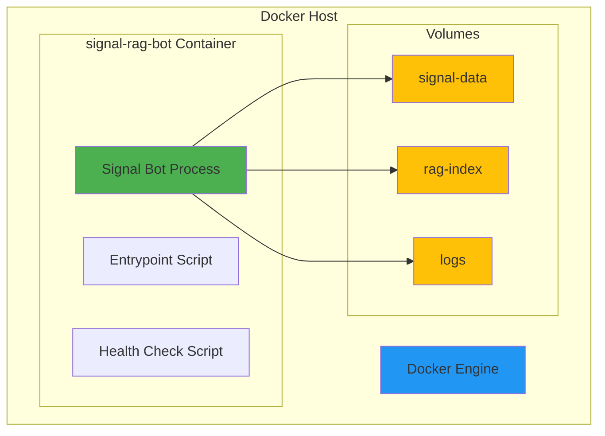

# Docker Deployment Guide

Deploy Signal RAG Bot using Docker for production environments.

---

## Overview

The Docker deployment provides:

- ✅ **Isolated Environment**: No dependency conflicts
- ✅ **Reproducible Builds**: Same environment everywhere
- ✅ **Easy Updates**: Pull new images and restart
- ✅ **Health Monitoring**: Built-in health checks
- ✅ **Resource Limits**: Controlled CPU and memory usage
- ✅ **Persistent Data**: Volumes for Signal data and RAG index

---

## Architecture



---

## Docker Image Details

### Multi-Stage Build

The Dockerfile uses a two-stage build for optimization:

**Stage 1: Builder**
- Base: `python:3.11-slim`
- Installs: gcc, g++, make, wget, git
- Downloads: signal-cli binary
- Creates: Python virtual environment with dependencies
- Size: ~800MB (discarded after build)

**Stage 2: Runtime**
- Base: `python:3.11-slim`
- Installs: OpenJDK 17 JRE (for signal-cli), curl, ca-certificates
- Copies: Virtual environment and signal-cli from builder
- Final size: **< 500MB**

### Image Contents

```
/app/
├── custom_rag.py           # RAG implementation
├── security.py             # Security controls
├── error_handling.py       # Error handling
├── monitoring.py           # Monitoring and metrics
├── signal_bot_rag.py       # Main bot application
├── logs/                   # Log directory (volume)
└── index/                  # RAG index directory (volume)

/opt/signal-cli/            # signal-cli installation
/opt/venv/                  # Python virtual environment
/usr/local/bin/
├── healthcheck             # Health check script
└── entrypoint              # Entrypoint script
```

---

## Building the Image

### Basic Build

```bash
docker build -t signal-rag-bot:latest .
```

### Build with Custom Tag

```bash
docker build -t signal-rag-bot:v1.0.0 .
```

### Build with BuildKit (faster)

```bash
DOCKER_BUILDKIT=1 docker build -t signal-rag-bot:latest .
```

### Verify Image Size

```bash
docker images signal-rag-bot
```

Expected output:
```
REPOSITORY         TAG       SIZE
signal-rag-bot     latest    487MB
```

---

## Running the Container

### Using docker run

```bash
docker run -d \
  --name signal-rag-bot \
  --restart unless-stopped \
  -e OPENAI_API_KEY="sk-your-key" \
  -e SIGNAL_PHONE_NUMBER="+31612345678" \
  -e ACTIVATION_PASSPHRASE="Activate Oracle" \
  -v signal-data:/root/.local/share/signal-cli \
  -v rag-index:/app/index \
  -v $(pwd)/logs:/app/logs \
  signal-rag-bot:latest
```

### Using Docker Compose (Recommended)

See [Docker Compose Guide](docker-compose.md) for full details.

---

## Environment Variables

### Required Variables

| Variable | Description | Example |
|----------|-------------|---------|
| `OPENAI_API_KEY` | OpenAI API key (must start with `sk-`) | `sk-proj-abc123...` |
| `SIGNAL_PHONE_NUMBER` | Phone number in E.164 format | `+31612345678` |

### Optional Variables

| Variable | Default | Description |
|----------|---------|-------------|
| `ACTIVATION_PASSPHRASE` | `"Activate Oracle"` | Passphrase for activation |
| `AUTHORIZED_USERS` | `""` | Comma-separated phone numbers |
| `LOG_LEVEL` | `INFO` | Logging level (DEBUG, INFO, WARNING, ERROR) |
| `MAX_TOKENS` | `200` | Max response tokens |
| `CHUNK_SIZE` | `1000` | Text chunk size for RAG |
| `CHUNK_OVERLAP` | `200` | Chunk overlap size |
| `SEARCH_K` | `3` | Number of chunks to retrieve |

---

## Volume Management

### Persistent Volumes

The container uses three volumes:

```yaml
volumes:
  # Signal account data (MUST persist)
  - signal-data:/root/.local/share/signal-cli

  # RAG index files (MUST persist)
  - rag-index:/app/index

  # Application logs (optional)
  - ./logs:/app/logs
```

### Backup Volumes

```bash
# Backup signal-data
docker run --rm \
  -v signal-data:/data \
  -v $(pwd)/backups:/backup \
  alpine tar czf /backup/signal-data-$(date +%Y%m%d).tar.gz /data

# Backup rag-index
docker run --rm \
  -v rag-index:/data \
  -v $(pwd)/backups:/backup \
  alpine tar czf /backup/rag-index-$(date +%Y%m%d).tar.gz /data
```

### Restore Volumes

```bash
# Restore signal-data
docker run --rm \
  -v signal-data:/data \
  -v $(pwd)/backups:/backup \
  alpine tar xzf /backup/signal-data-20251005.tar.gz -C /

# Restore rag-index
docker run --rm \
  -v rag-index:/data \
  -v $(pwd)/backups:/backup \
  alpine tar xzf /backup/rag-index-20251005.tar.gz -C /
```

---

## Health Checks

### Built-in Health Check

The Docker image includes a comprehensive health check script that validates:

- ✅ Python process is running
- ✅ signal-cli is accessible
- ✅ FAISS index exists
- ✅ Environment variables are set
- ✅ Disk space is available (> 1GB)

### Health Check Configuration

```yaml
healthcheck:
  test: ["/usr/local/bin/healthcheck"]
  interval: 30s      # Check every 30 seconds
  timeout: 10s       # Timeout after 10 seconds
  start_period: 60s  # Grace period on startup
  retries: 3         # Mark unhealthy after 3 failures
```

### Check Container Health

```bash
# View health status
docker inspect signal-rag-bot | jq '.[0].State.Health'

# Watch health status
watch -n 5 'docker inspect signal-rag-bot | jq ".[0].State.Health.Status"'
```

Expected output (healthy):
```json
{
  "Status": "healthy",
  "FailingStreak": 0,
  "Log": [
    {
      "Start": "2025-10-05T14:30:00Z",
      "End": "2025-10-05T14:30:01Z",
      "ExitCode": 0,
      "Output": "[HEALTH] ✓ All checks passed"
    }
  ]
}
```

---

## Entrypoint Script

The entrypoint script performs startup validation:

### Validation Steps

1. **Environment Variable Validation**
   - Checks `OPENAI_API_KEY` format (must start with `sk-`)
   - Checks `SIGNAL_PHONE_NUMBER` format (E.164: `+[1-9][0-9]{7,14}`)
   - Validates required variables are set

2. **Docker Secrets Support**
   - Checks `/run/secrets/openai_api_key`
   - Checks `/run/secrets/signal_phone_number`
   - Checks `/run/secrets/activation_passphrase`
   - Overrides environment variables if secrets found

3. **File System Checks**
   - Verifies write permissions on `/app/logs`
   - Verifies write permissions on `/app/index`

4. **Dependency Checks**
   - Validates Python packages installed
   - Validates signal-cli accessible

### Failure Modes

If validation fails, the container exits with:
- Exit code `1`
- Clear error message in logs
- No partial startup

Example error:
```
[ENTRYPOINT] ✗ OPENAI_API_KEY format is invalid (should start with 'sk-')
[ENTRYPOINT] ✗ Environment validation FAILED
```

---

## Resource Limits

### Recommended Limits

```yaml
deploy:
  resources:
    limits:
      cpus: '2.0'      # Max 2 CPU cores
      memory: 2G       # Max 2GB RAM
    reservations:
      cpus: '0.5'      # Reserve 0.5 CPU cores
      memory: 512M     # Reserve 512MB RAM
```

### Monitoring Resource Usage

```bash
# Real-time resource usage
docker stats signal-rag-bot

# Sample output
CONTAINER         CPU %     MEM USAGE / LIMIT     MEM %
signal-rag-bot    5.23%     847MiB / 2GiB        41.35%
```

---

## Security Options

### Security Configuration

```yaml
security_opt:
  - no-new-privileges:true  # Prevent privilege escalation
```

### Additional Security

```bash
# Run as non-root user (add to Dockerfile)
RUN useradd -m -u 1000 botuser
USER botuser

# Read-only root filesystem (add to docker-compose.yml)
read_only: true
tmpfs:
  - /tmp
  - /app/logs
```

---

## Logging

### Log Configuration

```yaml
logging:
  driver: "json-file"
  options:
    max-size: "10m"      # Max 10MB per log file
    max-file: "5"        # Keep 5 rotated files
    labels: "service=signal-rag-bot"
```

### View Logs

```bash
# Follow logs in real-time
docker logs -f signal-rag-bot

# View last 100 lines
docker logs --tail 100 signal-rag-bot

# View logs since 1 hour ago
docker logs --since 1h signal-rag-bot

# View logs with timestamps
docker logs -t signal-rag-bot
```

### Export Logs

```bash
# Export to file
docker logs signal-rag-bot > bot-logs-$(date +%Y%m%d).log

# Export JSON logs
docker logs signal-rag-bot 2>&1 | jq '.' > structured-logs.json
```

---

## Updating the Container

### Update Process

```bash
# 1. Pull latest code
git pull origin main

# 2. Rebuild image
docker-compose build

# 3. Stop current container
docker-compose down

# 4. Start with new image
docker-compose up -d

# 5. Verify health
docker-compose ps
docker-compose logs -f
```

### Zero-Downtime Update (Advanced)

```bash
# 1. Start new container with different name
docker-compose -p signal-rag-bot-new up -d

# 2. Verify new container is healthy
docker inspect signal-rag-bot-new_signal-rag-bot_1 | jq '.[0].State.Health.Status'

# 3. Stop old container
docker-compose -p signal-rag-bot down

# 4. Rename new container
docker rename signal-rag-bot-new_signal-rag-bot_1 signal-rag-bot
```

---

## Troubleshooting

### Container Won't Start

Check entrypoint validation:
```bash
docker logs signal-rag-bot | grep ENTRYPOINT
```

Common issues:
- Invalid `OPENAI_API_KEY` format
- Invalid phone number format
- Missing environment variables

### Container is Unhealthy

Check health check logs:
```bash
docker inspect signal-rag-bot | jq '.[0].State.Health.Log[-1]'
```

Common issues:
- FAISS index not found
- signal-cli not responding
- Disk space < 1GB

### High Memory Usage

Check memory stats:
```bash
docker stats signal-rag-bot --no-stream
```

Solutions:
- Reduce `SEARCH_K` value
- Reduce `CHUNK_SIZE`
- Increase memory limit in docker-compose.yml

### Permission Errors

Verify volume permissions:
```bash
docker exec signal-rag-bot ls -la /app/logs
docker exec signal-rag-bot ls -la /app/index
```

Fix permissions:
```bash
docker exec signal-rag-bot chown -R 1000:1000 /app/logs
docker exec signal-rag-bot chown -R 1000:1000 /app/index
```

---

## Next Steps

- 📖 [Docker Compose Guide](docker-compose.md) - Orchestration with Docker Compose
- 🔐 [Docker Secrets](secrets.md) - Secure credential management
- ☁️ [Cloud Deployment](cloud.md) - Deploy to AWS, DigitalOcean, GCP
- 🔧 [VPS Deployment](vps.md) - Deploy to your own VPS

---

## Reference

- [Dockerfile Source](https://github.com/BramAlkema/signal-rag-bot/blob/main/Dockerfile)
- [Health Check Script](https://github.com/BramAlkema/signal-rag-bot/blob/main/docker/healthcheck.sh)
- [Entrypoint Script](https://github.com/BramAlkema/signal-rag-bot/blob/main/docker/entrypoint.sh)
