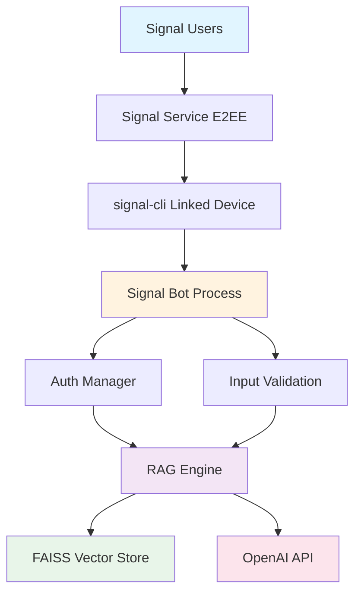

# Signal RAG Bot Documentation

**Production-ready Signal chatbot with RAG using FAISS vector store**

---

## Overview

Signal RAG Bot is a secure, production-grade chatbot that integrates with Signal Messenger to provide intelligent Q&A capabilities using Retrieval-Augmented Generation (RAG) over a custom knowledge base. Built with security, reliability, and deployability as core principles.

## Key Features

- 🔒 **Secure by Design**: Passphrase activation, rate limiting, input validation
- 🤖 **Intelligent RAG**: FAISS vector search with OpenAI embeddings
- 📱 **Signal Integration**: Linked device mode (no separate phone number needed)
- 🐳 **Production Ready**: Docker deployment with health checks and monitoring
- 🛡️ **Enterprise Security**: Comprehensive security controls and audit logging
- 📊 **Observable**: Structured logging, metrics, and alerting

## Quick Links

-   :material-rocket-launch:{ .lg .middle } __Getting Started__

    ---

    New to Signal RAG Bot? Start here for installation and setup.

    [:octicons-arrow-right-24: Quick Start](getting-started/quickstart.md)

-   :material-docker:{ .lg .middle } __Deployment__

    ---

    Deploy with Docker, Docker Compose, or to the cloud.

    [:octicons-arrow-right-24: Docker Guide](deployment/docker.md)

-   :material-shield-lock:{ .lg .middle } __Security__

    ---

    Learn about security architecture and best practices.

    [:octicons-arrow-right-24: Security Overview](security/overview.md)

-   :material-api:{ .lg .middle } __API Reference__

    ---

    Detailed API documentation for developers.

    [:octicons-arrow-right-24: API Docs](api/custom-rag.md)

## Architecture Overview

## System Requirements

| Component | Minimum | Recommended |
|-----------|---------|-------------|
| **OS** | Linux, macOS | Ubuntu 20.04+, macOS 12+ |
| **Python** | 3.11+ | 3.11+ |
| **RAM** | 2GB | 4GB |
| **Disk** | 2GB | 5GB |
| **Java** | OpenJDK 17+ | OpenJDK 17+ |

## Use Cases

### Customer Support
Provide 24/7 automated support to customers via Signal with knowledge base backed by your documentation.

### Internal Knowledge Base
Give employees instant access to company policies, procedures, and documentation through Signal.

### Community Q&A
Build a community bot that answers questions based on curated content and documentation.

### Research Assistant
Create a research assistant that can answer questions from academic papers or research documents.

## Security Highlights

- **Passphrase Activation**: Users must provide exact passphrase before accessing the bot
- **Rate Limiting**: 10 messages/minute, 100 messages/hour per user
- **Input Validation**: Comprehensive sanitization and injection prevention
- **Secrets Management**: Docker secrets and environment variable support
- **Audit Logging**: Privacy-preserving audit trail with hashed user IDs
- **Threat Detection**: Suspicious pattern detection and anomaly monitoring

## Performance Characteristics

- **Response Time**: p95 < 5 seconds
- **Search Latency**: p95 < 100ms
- **Concurrent Users**: 100+
- **Uptime Target**: 99%+
- **Memory Usage**: < 2GB peak

## What's Next?

!!! tip "New Users"
    Follow our [Quick Start Guide](getting-started/quickstart.md) to get your bot running in 15 minutes.

!!! info "Deploying to Production"
    Check out the [Docker Deployment Guide](deployment/docker.md) for production-ready deployment.

!!! warning "Security First"
    Review the [Security Overview](security/overview.md) before deploying to production.

## Project Information

- **License**: MIT
- **Repository**: [GitHub](https://github.com/BramAlkema/signal-rag-bot)
- **Version**: 1.0.0
- **Status**: Production-Ready Candidate

---

*Built with security, reliability, and developer experience in mind.*
