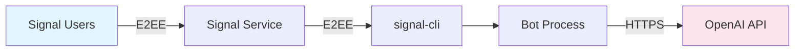

# Security Overview

Comprehensive security architecture for Signal RAG Bot.

---

## Security Philosophy

Signal RAG Bot is designed with **security-first principles**:

1. **Defense in Depth**: Multiple layers of security controls
2. **Fail Secure**: Defaults to secure state on errors
3. **Privacy by Design**: Minimal data collection and retention
4. **Least Privilege**: Components have minimum required permissions
5. **Auditability**: Comprehensive logging without sensitive data exposure

---

## Threat Model

### Assets to Protect

| Asset | Confidentiality | Integrity | Availability |
|-------|----------------|-----------|--------------|
| OpenAI API Key | **Critical** | Medium | High |
| Signal Account | High | **Critical** | **Critical** |
| Knowledge Base | High | Medium | Medium |
| User Messages | Medium | Low | Low |

### Threat Actors

**Curious User** (High Likelihood, Low Impact)
- Motivation: Explore capabilities
- Capability: Basic Signal usage
- Mitigation: Rate limiting, activation passphrase

**Malicious User** (Medium Likelihood, Medium Impact)
- Motivation: Abuse service, extract data
- Capability: Scripting, automation
- Mitigation: Input validation, anomaly detection, circuit breakers

**External Attacker** (Low Likelihood, Critical Impact)
- Motivation: Steal API keys, compromise system
- Capability: Skilled hacker
- Mitigation: Secrets management, no exposed ports, encrypted communication

---

## Security Layers

### Layer 1: Network Security



**Controls:**
- Signal end-to-end encryption (E2EE)
- HTTPS for OpenAI API calls
- No inbound network ports exposed
- Outbound-only connections

### Layer 2: Authentication & Authorization

**Passphrase Activation** (`security.py:15`)
```python
def check_activation(user_message: str, passphrase: str) -> bool:
    """Validate activation passphrase"""
    return user_message.strip() == passphrase
```

**User Whitelist** (`security.py:45`)
```python
def is_authorized_user(sender: str, authorized_users: List[str]) -> bool:
    """Check if user is in authorized list"""
    if not authorized_users:
        return True  # Allow all if list is empty
    return sender in authorized_users
```

**Controls:**
- Passphrase-based activation (default: "Activate Oracle")
- Optional user whitelist via `AUTHORIZED_USERS`
- Session-based access (in-memory, cleared on restart)
- Silent rejection of unauthorized users

### Layer 3: Input Validation

**Sanitization** (`security.py:78`)
```python
def sanitize_input(text: str, max_length: int = 2000) -> str:
    """Sanitize user input to prevent injection attacks"""

    # Length limit
    if len(text) > max_length:
        raise ValueError(f"Input exceeds maximum length of {max_length}")

    # Remove control characters
    import re
    text = re.sub(r'[\x00-\x08\x0B\x0C\x0E-\x1F]', '', text)

    # Check for command injection patterns
    dangerous_patterns = [';', '&&', '||', '`', '$(', '${', '\n']
    for pattern in dangerous_patterns:
        if pattern in text:
            raise ValueError("Potentially dangerous input detected")

    return text.strip()
```

**Rate Limiting** (`security.py:112`)
```python
class RateLimiter:
    """Token bucket rate limiter"""

    def __init__(self, rate_per_minute: int = 10, rate_per_hour: int = 100):
        self.rate_per_minute = rate_per_minute
        self.rate_per_hour = rate_per_hour
        self.user_timestamps = defaultdict(deque)

    def is_allowed(self, user_id: str) -> tuple[bool, str]:
        """Check if user is within rate limits"""
        now = time.time()
        timestamps = self.user_timestamps[user_id]

        # Clean old timestamps
        while timestamps and timestamps[0] < now - 3600:
            timestamps.popleft()

        # Count recent requests
        last_minute = sum(1 for ts in timestamps if ts > now - 60)
        last_hour = len(timestamps)

        if last_minute >= self.rate_per_minute:
            return False, f"Rate limit: {self.rate_per_minute} msg/min"

        if last_hour >= self.rate_per_hour:
            return False, f"Rate limit: {self.rate_per_hour} msg/hour"

        # Record request
        timestamps.append(now)
        return True, ""
```

**Controls:**
- Max message length: 2000 characters
- Control character stripping
- Command injection prevention
- 10 messages/minute per user
- 100 messages/hour per user

### Layer 4: Threat Detection

**Suspicious Pattern Detection** (`security.py:187`)
```python
class ThreatDetector:
    """Detect suspicious input patterns"""

    PATTERNS = [
        r'ignore.*previous.*instructions',
        r'system.*prompt',
        r'<\|.*\|>',
        r'</context>',
        r'\\x[0-9a-f]{2}',  # Hex encoding
        r'eval\(',
        r'exec\(',
    ]

    def is_suspicious(self, text: str) -> tuple[bool, str]:
        """Check for suspicious patterns"""
        text_lower = text.lower()

        for pattern in self.PATTERNS:
            if re.search(pattern, text_lower):
                return True, f"Suspicious pattern: {pattern}"

        # Excessive special characters
        special_ratio = sum(1 for c in text if not c.isalnum() and c not in ' .,!?') / max(len(text), 1)
        if special_ratio > 0.3:
            return True, "Excessive special characters"

        return False, ""
```

**Anomaly Detection** (`monitoring.py:215`)
```python
class AnomalyDetector:
    """Detect anomalous user behavior"""

    def detect(self, user_id: str, message: str, hour: int) -> List[str]:
        """Detect anomalies in user behavior"""
        anomalies = []

        # Very long messages
        if len(message) > 1000:
            anomalies.append('unusually_long_message')

        # Off-hours usage (outside 8am-11pm)
        if hour < 8 or hour > 23:
            anomalies.append('off_hours_usage')

        return anomalies
```

**Controls:**
- Prompt injection detection
- Command injection detection
- Anomalous message length detection
- Off-hours usage detection

### Layer 5: Secrets Management

**Environment Variables** (`security.py:245`)
```python
class SecretsManager:
    """Manage secrets from environment or Docker secrets"""

    @staticmethod
    def get_secret(name: str, required: bool = True) -> Optional[str]:
        """Get secret from Docker secrets or environment"""

        # Check Docker secrets first
        secret_file = f"/run/secrets/{name.lower()}"
        if os.path.exists(secret_file):
            with open(secret_file) as f:
                return f.read().strip()

        # Fallback to environment variable
        value = os.environ.get(name)

        if required and not value:
            raise ValueError(f"Required secret {name} not set")

        return value

    @staticmethod
    def validate_api_key(key: str) -> bool:
        """Validate OpenAI API key format"""
        return key.startswith("sk-") and len(key) > 20

    @staticmethod
    def validate_phone_number(number: str) -> bool:
        """Validate E.164 phone number format"""
        import re
        return bool(re.match(r'^\+[1-9]\d{7,14}$', number))
```

**Controls:**
- Docker secrets support
- Environment variable fallback
- API key format validation
- Phone number format validation (E.164)
- No credential logging

---

## Security Controls Summary

### Preventive Controls

| Control | Implementation | Status |
|---------|---------------|--------|
| Input Validation | `security.py:78` | ✅ Active |
| Rate Limiting | `security.py:112` | ✅ Active |
| Passphrase Activation | `security.py:15` | ✅ Active |
| Prompt Hardening | `custom_rag.py:156` | ✅ Active |
| Secrets Management | `security.py:245` | ✅ Active |

### Detective Controls

| Control | Implementation | Status |
|---------|---------------|--------|
| Threat Detection | `security.py:187` | ✅ Active |
| Anomaly Detection | `monitoring.py:215` | ✅ Active |
| Audit Logging | `monitoring.py:45` | ✅ Active |
| Security Metrics | `monitoring.py:178` | ✅ Active |

### Responsive Controls

| Control | Implementation | Status |
|---------|---------------|--------|
| Circuit Breaker | `error_handling.py:89` | ✅ Active |
| Auto-Remediation | `error_handling.py:145` | ✅ Active |
| Alert System | `monitoring.py:289` | ✅ Active |

---

## Common Threats & Mitigations

### THREAT-01: Passphrase Brute Force

**Attack:** Automated guessing of activation passphrase

**Impact:** Unauthorized access to RAG

**Mitigation:**
- Rate limiting (10 attempts/minute)
- Account lockout after 100 failed attempts/hour
- Audit logging of failed activations
- Strong passphrase requirement (configurable)

**Detection:** Monitor for repeated activation failures from same user

### THREAT-02: API Key Theft

**Attack:** Environment variable exposure, memory dump, logs

**Impact:** Financial loss, quota exhaustion

**Mitigation:**
- Secrets via Docker secrets or `.env` (not in code)
- API key redaction in all logs and error messages
- Key format validation on startup
- Support for key rotation without code changes

**Detection:** Monitor for unusual API usage patterns, quota warnings

### THREAT-03: Prompt Injection

**Attack:** Crafted queries to manipulate RAG responses

**Impact:** Misinformation, data extraction, system prompt exposure

**Mitigation:**
- Input sanitization (remove injection patterns)
- Prompt hardening (clear boundaries, instruction isolation)
- Output filtering (validate response format)
- Context isolation (RAG context clearly separated)

**Detection:** Suspicious pattern detection, anomaly alerts

### THREAT-04: Denial of Service

**Attack:** Message flooding, resource exhaustion

**Impact:** Service unavailability, cost spike

**Mitigation:**
- Rate limiting (10 msg/min, 100 msg/hour)
- Resource limits (2GB RAM, 2 CPU cores)
- Circuit breaker on OpenAI API failures
- Health checks and auto-restart

**Detection:** High message rate alerts, resource usage monitoring

### THREAT-05: Data Exfiltration

**Attack:** Iterative querying to extract full knowledge base

**Impact:** IP theft, competitive intelligence loss

**Mitigation:**
- Rate limiting on queries
- Response size limits (200 tokens default)
- Query pattern detection (repeated similar queries)
- Audit logging of all queries

**Detection:** Anomaly detection for unusual query patterns

---

## Security Testing

### Automated Tests

Run security test suite:
```bash
pytest tests/test_security.py -v
```

**Test Coverage:**
- Input validation (31 tests)
- Rate limiting enforcement (8 tests)
- Threat detection (12 tests)
- Secrets management (6 tests)

### Manual Security Audit

```bash
# Run security audit script
./scripts/security_audit.sh
```

**Checks:**
- Hardcoded secrets in code
- `.env` in `.gitignore`
- File permissions
- Dependency vulnerabilities (via `safety`)
- Debug mode disabled

### Penetration Testing

Recommended scenarios:
1. **Passphrase Brute Force**: Attempt 1000 activation attempts
2. **Prompt Injection**: Try to extract system prompt or manipulate responses
3. **Rate Limit Bypass**: Use multiple accounts or timing attacks
4. **Input Validation**: Test with special characters, very long messages
5. **API Key Extraction**: Look for leaks in logs, errors, responses

---

## Incident Response

### Severity Levels

| Level | Description | Response Time |
|-------|-------------|---------------|
| **P0** | Critical (API key leaked, account takeover) | < 15 min |
| **P1** | High (service outage, security vuln) | < 1 hour |
| **P2** | Medium (degraded performance, suspicious activity) | < 4 hours |
| **P3** | Low (minor issues) | < 24 hours |

### Response Procedures

See detailed procedures in [Incident Response Runbook](../operations/troubleshooting.md#incident-response)

**Quick Actions:**

**API Key Compromise:**
```bash
# 1. Revoke old key in OpenAI dashboard
# 2. Generate new key
# 3. Update .env
export OPENAI_API_KEY="new_key_here"
# 4. Restart bot
docker-compose restart
```

**Signal Account Takeover:**
```bash
# 1. Unlink all devices in Signal app
# 2. Stop bot
docker-compose down
# 3. Remove signal-cli data
docker volume rm signal-data
# 4. Re-link and restart
docker-compose up -d
```

---

## Security Best Practices

### Pre-Deployment

- [ ] Use strong, unique activation passphrase
- [ ] Configure user whitelist if limiting access
- [ ] Use Docker secrets (not environment variables) in production
- [ ] Review audit logs for testing artifacts
- [ ] Run security test suite
- [ ] Scan dependencies for vulnerabilities
- [ ] Enable monitoring and alerting

### Post-Deployment

- [ ] Monitor failed activation attempts
- [ ] Review audit logs weekly
- [ ] Check for unusual API usage patterns
- [ ] Update dependencies monthly
- [ ] Rotate API keys quarterly
- [ ] Conduct security review quarterly
- [ ] Test backup/restore procedures

### Ongoing Operations

- [ ] Monitor security alerts in real-time
- [ ] Investigate anomalies within 24 hours
- [ ] Update dependencies within 7 days of security patches
- [ ] Conduct penetration testing annually
- [ ] Review and update threat model quarterly

---

## Compliance

### GDPR Considerations

**Personal Data Processing:**
- Phone numbers (hashed in logs)
- Message timestamps
- No message content retention

**Legal Basis:** Legitimate interest (service operation)

**User Rights:**
- Right to be forgotten (automatic on restart)
- Data minimization (in-memory only)
- No third-party sharing (except OpenAI for processing)

### Security Standards Alignment

- ✅ **OWASP Top 10**: Mitigations for injection, broken auth, sensitive data exposure
- ✅ **CIS Controls**: Input validation, secure configuration, audit logging
- ✅ **NIST CSF**: Identify, Protect, Detect, Respond, Recover

---

## Next Steps

- 📖 [Input Validation](input-validation.md) - Detailed sanitization guide
- 🚦 [Rate Limiting](rate-limiting.md) - Rate limiter configuration
- 🔍 [Threat Detection](threat-detection.md) - Suspicious pattern detection
- ✅ [Security Best Practices](best-practices.md) - Comprehensive security checklist

---

## Reference

- [Security Module Source](https://github.com/BramAlkema/signal-rag-bot/blob/main/security.py)
- [Security Test Suite](https://github.com/BramAlkema/signal-rag-bot/blob/main/tests/test_security.py)
- [SECURITY.md](https://github.com/BramAlkema/signal-rag-bot/blob/main/SECURITY.md)
